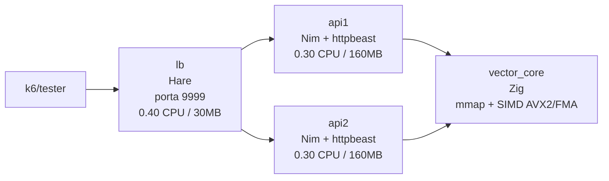
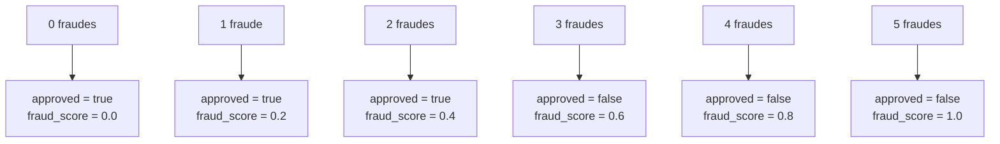

# Rinha de Backend 2026

## Desafio

Manter a classificação certa e responder rápido.

## Arquitetura

A topologia inteira cabe no orçamento da competição e não faz mais do que precisa:



Orçamento total: `1.0 CPU` e `350MB`.

## Fluxo da requisição

1. O custom load balancer escrito em Hare aceita conexões em `:9999` e faz round-robin entre `172.30.0.11:8080` e `172.30.0.12:8080`.
2. A API escrita em Nim recebe `POST /fraud-score`, parseia o JSON manualmente e monta um vetor normalizado de 14 dimensões.
3. O vetor é enviado via FFI para o core escrito em Zig.
4. O Zig executa k-NN com `K = 5` sobre os vetores de referência.
5. A resposta segue esta regra:



## Vetorização

A API replica a normalização em 14 dimensões:

- valor da transação, parcelas e relação `amount / avg_amount`;
- hora, dia da semana e intervalo desde a última transação;
- distância da última transação e distância de casa;
- volume 24h;
- flags `is_online`, `card_present` e merchant conhecido;
- risco por MCC;
- média do merchant.

O parser é manual porque esse trecho é quente e eu não queria pagar custo de alocação e DOM JSON a cada request. Se o parse falha, a API bloqueia a transação (`fraud_score=1.0`).

## Pre-processamento

O pre-processamento acontece no build, não em runtime. Durante a geração da imagem, o `Dockerfile` baixa `references.json.gz` do repo da rinha e executa `src/preprocess.nim`.

Dessa etapa saem quatro arquivos:

- `vectors.bin`: vetores em layout SoA, `int16`, ordenados por cluster IVF;
- `residuals.bin`: residual `int8` por dimensão para refinamento fino;
- `labels.bin`: label compacta por vetor;
- `ivf.bin`: centroides, raios e limites dos clusters.

Parâmetros atuais:

```text
D = 14
N = 3_000_000
clusters IVF = 4096
nprobe = 24
sample k-means = 65_536
iterações k-means = 25
```

## Busca vetorial

O core em `src/vector_core.zig` consulta os dados em três passos:

1. Calcula a distância para os centroides IVF e seleciona os `24` clusters mais próximos.
2. Varre os vetores desses clusters com SIMD AVX2, mantendo uma shortlist de `TOP_C = 8`.
3. Expande a busca usando o raio dos clusters para preservar exatidão quando algum cluster não sondado ainda pode conter vizinhos melhores.

Depois da shortlist, entra um refinamento curto:

- a ordem principal usa `int16` com escala `32767`;
- os candidatos são refinados com residual de 7 bits (`REFINE_STEP = 128`);
- se a diferença entre o 5º e o 6º vizinho coarse for muito pequena (`COARSE_TIE_GAP = 512`), a ordem coarse é mantida para evitar troca indevida em casos de borda.

Foi esse refinamento que eliminou o false positive que aparecia antes.

## Load balancer

O LB em `lb/lb.ha` é simples de propósito:

- epoll single-process;
- buffers fixos;
- `TCP_NODELAY`;
- pool fixo de pares cliente/backend;
- round-robin entre as duas APIs;
- sem log, sem lógica de negócio e sem transformação de payload.

A ideia foi fazer um lb enxuto e tirar o overhead de proxies genéricos.

obs: Eu não fazia a menor ideia de como o Hare funcionava, e foi bem legal estudar ela para montar um lb.

## Memória e startup

O Zig abre os binários em `mmap` read-only e faz pre-fault das páginas no startup. Isso derruba a latência fria das primeiras requisições e evita carregar o JSON bruto em runtime.

O JSON só aparece na fase de build. A imagem final leva apenas os binários compactos e o executável.

## Trade-offs

- A expansão por raio custa mais latência do que uma ANN pura, mas foi o que zerou FP/FN no teste local.
- Eu cheguei a testar uma variante ANN sem expansão. Ela chegou a `0.34ms`, mas voltou a errar detecção, então desisti dessa ideia.
- `residuals.bin` adiciona cerca de `42MB`, mas ainda cabe no limite com duas APIs e resolve casos de borda que o coarse sozinho não resolvia bem.

## Referências

- k-NN e vizinhos mais próximos: [Nearest Neighbors](https://www.ibm.com/br-pt/think/topics/knn)
- k-means para a etapa de clusterização: [KMeans](https://www.ibm.com/br-pt/think/topics/k-means-clustering)
- `mmap` e mapeamento de arquivos em memória: [mmap(2) no man7](https://man7.org/linux/man-pages/man2/mmap.2.html)
- [SIMD, AVX2 e intrinsics](https://medium.com/@meriffa/net-core-concepts-simd-avx-intrinsics-0e30c845ebca)
- IVF, listas invertidas e `nprobe`: [Faiss IndexIVF](https://medium.com/@Jawabreh0/inverted-file-indexing-ivf-in-faiss-a-comprehensive-guide-c183fe979d20)
- [hare](https://harelang.org/)